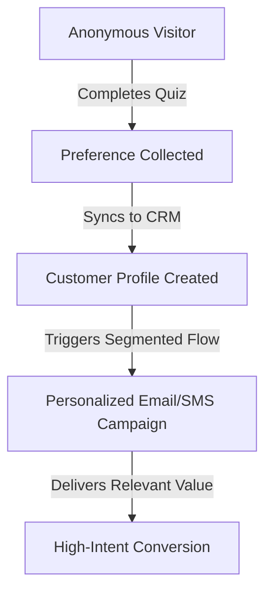

export const lessonMeta = {
  title: "Zero-Party Data Strategy",
  level: "Advanced",
  summary: "How to collect and activate consumer-volunteered preferences, sizes, and interests to drive hyper-personalized campaigns.",
  category: "email",
  slug: "zero-party-data",
};

# Zero-Party Data Strategy

Imagine trying to buy a gift for a friend. You could sneak into their room, inspect their wardrobe, and guess their size (third-party tracking). Or you could simply ask them what they want (zero-party data). 

With third-party cookies phased out and privacy laws like GDPR tightening, guessing is no longer a viable option. Modern marketing requires asking.

## Quick Summary

- Zero-party data is data that a customer proactively and intentionally shares with a brand, such as survey answers or product preferences.
- It differs from first-party data, which is behaviorally observed (e.g., website clicks and pages viewed).
- Over 85% of marketers identify zero-party data as essential for personalization (Envive AI, 2024).
- Interactive quizzes and preference centers convert at an average rate of 61% (Demand Local, 2024).
- Successful brands automatically sync volunteered preferences directly to their CRM to trigger segmented email and SMS flows.

---

## Defining the Data Spectrum

Marketers use different types of data to target campaigns. Knowing the difference between them is critical for compliance and relevance.

**Third-Party Data**: Data collected by outside companies from various websites and sold to advertisers. This includes broad demographic data and browser tracking cookies. It is rapidly disappearing due to privacy restrictions.

**First-Party Data**: Data your brand collects directly from user behavior on your own properties. This includes purchase history, email click rates, and pages viewed. It tells you what a user does, but not necessarily why.

**Zero-Party Data**: Data a consumer deliberately shares with you. This includes product preferences, sizing, skin type, or buying intent. It is accurate, consent-backed, and requires a clear value exchange.

<Callout type="info">
**What is a Value Exchange?** A value exchange means giving the customer immediate, tangible value in return for their information. Examples include a personalized product recommendation, a custom styling guide, or a discount.
</Callout>

---

## Collection Workflows

To get zero-party data, you must build touchpoints that make sharing information feel natural and rewarding.

### 1. Interactive Onboarding Quizzes
Quizzes are the most popular collection tool for e-commerce. You ask five to seven questions about the customer's needs, then recommend the exact product they should buy.

### 2. Preference Centers
Instead of a simple unsubscribe link, offer a preference center. Let subscribers choose their email frequency (e.g., weekly, monthly) and topics of interest.

### 3. Progressive Profiling
Do not ask for twenty details at once. Ask one question in the welcome series, another post-purchase, and a third during a review request. Build the profile over time.

---

## Real Brand Case Studies

### Case Study 1: SKOON Skincare (2024)
Skincare brand SKOON implemented a product recommendation quiz to help customers build a personalized skin routine. 

By asking questions about skin type, age, and lifestyle, they collected explicit preference data. This zero-party strategy generated over 13,000 new email profiles.

The personalized recommendations resulted in a **3.5x higher conversion rate** and earned a **68x return on investment** (Visual Quiz Builder, 2024).

### Case Study 2: Polysleep (2024)
Mattress manufacturer Polysleep designed a quiz to guide shoppers through their buying journey.

They asked visitors about sleeping positions, firmness preferences, and sleeping temperature. 

The custom recommendations eliminated browsing confusion, resulting in a **6x improvement in conversion rates** (Octane AI, 2024).

---

## Activating the Data

Collecting data is useless if it sits in a silo. You must connect your collection tools to your email service provider (ESP) or customer data platform (CDP).

Use tags to route users into automated flows:
- If a shopper selects "Dry Skin" in your quiz, send them a hydration welcome sequence.
- If a subscriber selects "Weekly Newsletter" in the preference center, exclude them from daily promos.
- Use zero-party data tags to build lookalike audiences on paid platforms.

---

## Common Mistakes

- **Asking without giving**: If you demand a user's birthday, skin type, and budget without providing a recommendation or reward, they will abandon the form.
- **Overwhelming friction**: Keep onboarding quizzes to five to seven questions. Every additional step cuts completion rates by 10%.
- **Stale data**: Preferences change. Prompt users to update their profile once a year or after a major purchase.

---

## Key Takeaways

- Zero-party data is the most reliable alternative to cookie-based targeting in a privacy-first landscape.
- Always provide a clear value exchange when asking for personal preferences.
- Keep quizzes short, engaging, and integrated with your automation flows.

---

## Interview Q&A

**Q: How does zero-party data differ from first-party data?**
A: First-party data is behavioral and passively collected by tracking actions (e.g., clicks and past purchases). Zero-party data is voluntarily and proactively shared by the customer (e.g., quiz answers and sizing preferences).

**Q: How do you prevent drop-offs during zero-party data collection?**
A: Use a strict friction budget. Limit quizzes to 5-7 questions, explain why the data is needed, and offer immediate value like a personalized routine or a discount code on completion.

**Q: How do you activate zero-party data in email automation?**
A: Sync responses to the ESP or CRM as custom properties. Use these properties to trigger segmented flows, dynamically swap product blocks, and personalize subject lines based on self-reported interests.

<ResourceList resources={[
  { title: "How SKOON Personalized Skincare for Customers and Notched 3.5x Conversion (Visual Quiz Builder)", url: "https://www.visualquizbuilder.com/post/how-skoon-personalized-skincare-for-customers-and-notched-3-5x-conversion", type: "article", free: true, note: "Data-backed results from routine finder quizzes." },
  { title: "How Polysleep 6x Conversion Rates With Their Quiz (Octane AI)", url: "https://www.octaneai.com/customers/polysleep-quiz-drives-600-percent-conversion-rate", type: "article", free: true, note: "Ecommerce conversion rate lift via personalization." },
  { title: "WsCube Tech - Zero-Party Data (Hindi)", url: "https://www.youtube.com/@WsCubeTech", type: "video", lang: "hi", free: true, note: "Top Hindi digital marketing channel" },
  { title: "Mr Digital Marketing Tamil - E-commerce Personalization", url: "https://www.youtube.com/channel/UCQpgJad_YaHAW_CVFTBNyiw", type: "video", lang: "ta", free: true, note: "Tamil digital marketing tutorials" },
  { title: "ODMT Telugu - First-Party and Zero-Party Data", url: "https://www.youtube.com/@ODMTtelugu", type: "video", lang: "te", free: true, note: "Telugu digital marketing training" },
]} />
